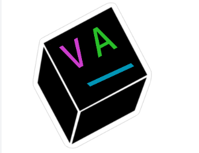

# V.A.I. - Visual Aided Interface

## Contents

  - [Introduction](#Introduction "Introduction")
  - [GUI Server Dependencies](#GUI-Server-Dependencies "GUI Server Dependencies")
  - [Usage](#Usage "Usage")
  
  ## Introduction
  
In order to assist those who are restricted to wheelchairs or otherwise impaired by paralysis, we are aiming to assist their daily life through gesture controls, image processing, and voice command features.  Interfacing in this way allows the user to move between rooms, make emergency calls, and order food and transportation services.  This project serves as the frontend GUI aid for remotely controlling the simulated robotics, written in HTML, CSS, JS, and wrapped with Python via a [flask](https://github.com/pallets/flask) server | HackMIT 2020 Health Tech
  
  ## GUI Server Dependencies
  
  ## Usage

Intended for use with eye blink tracking software such as [OpenCV](https://github.com/opencv/opencv) w/ [dlib](https://github.com/davisking/dlib), with simulated robotics via [gazebo](https://github.com/osrf/gazebo), [rviz](https://github.com/ros-visualization/rviz), [tinkercad](https://www.tinkercad.com), and [ROS packages](https://github.com/ros/ros).  It can be demoed (without the automated tabbing) with mouse clicks by simply cloning the project and running:
```
$ python app.py
```

  ### Footage:
